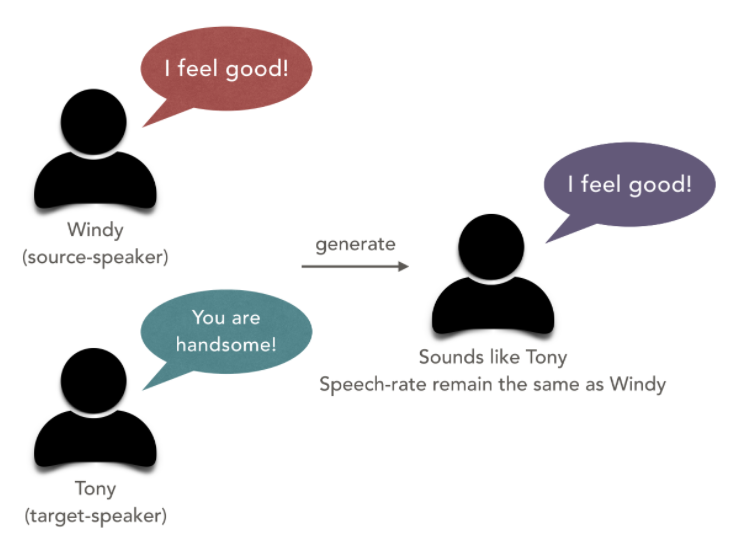
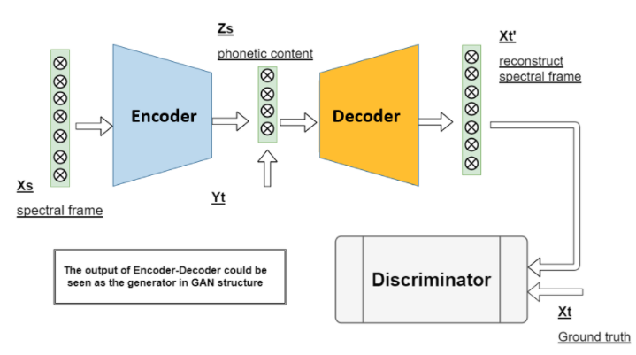
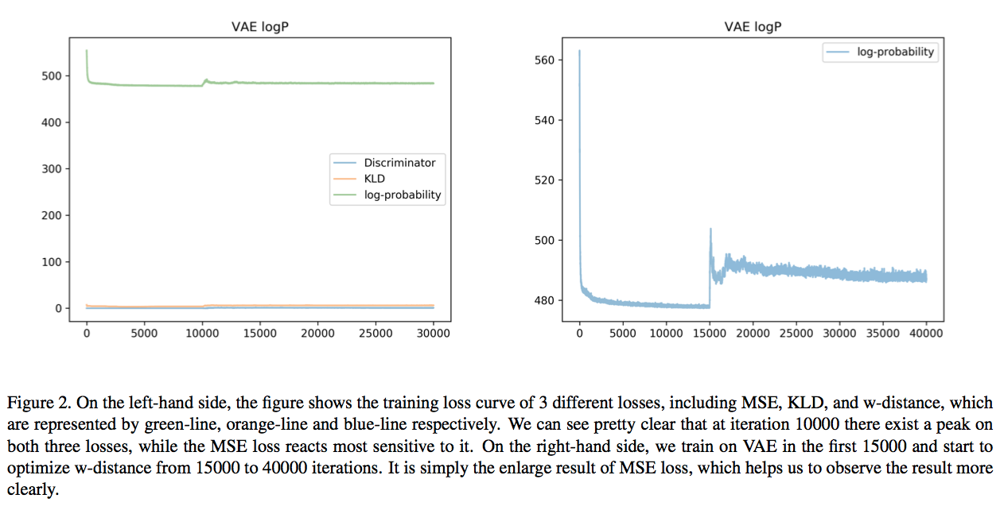
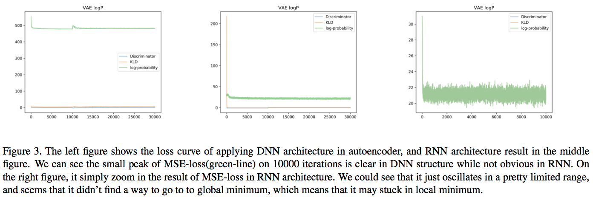

# Adversarial Training On General Voice Conversion 
Author: Hao-Chun Yang, Gao-Yi Chao, Hui-Ting Hong, Kun-Chieh Hsu  

This work is mainly inspired by [*"Voice Conversion from Unaligned Corpora using Variational Autoencoding Wasserstein Generative Adversarial Networks"*](https://arxiv.org/abs/1704.00849).   To see more detail refer to [report](./report.pdf).

## Introduction

Voice conversion(VC) is a classical task which usually aims at transforming the voice of a source speaker into that of a target speaker while preserving the linguistic content[2]. In this project, we are going to deal with this classical task with unaligned corpora in conditional variational autoencoder with adversarial training.  
Many techniques have been developed for VC, such as Gaussian mixture models, Hidden Markov models, Gaussian regression, RNN. One big issue in the training of the speech conversion system is data, which prefers parallel and pairwise data. Since the inter-speaker speech alignment could be a problem for machines to learn speech style among different individuals. Hence, in this work, we apply adversarial training architecture for speech style transformation. 

#### Files:  
* [vae-gan-hgy.py](./Scripts/vae-gan-hgy.py): for running the code.

## Methodology

The structure we are going to use is the variational autoencoder combined with the discriminator for VC problem.  

* **Stage-1**: -c-VAE - 
Encode into a speaker independent latent representation z -> reconstruct the spectral information -> Evaluated in KLD(KL Divergence) and MSE(Mean Square Error). 
* **Stage-2**: -Discriminator - 
Evaluate the similarity between reconstruct spectral information and target feature. Here we use improved W-GAN as the training objectives. Its discriminative power gives us a supervision on judging whether the generated speech probability distribution is approximate to the real target speakers speech distribution. We believe that with the combination of conditional VAE and adversarial training techniques, we are able to implement a voice conversion system with better acoustic style transfer result. Also, in our experiments, we applied both DNN and RNN version of the network. The main idea using RNN is that it can utilize their internal memory to process arbitrary sequences of inputs to exhibit the dynamic temporal behavior of a sequence, and we plan to use long short-term memory networks (LSTM) as an Encoder-Decoder structure to hopefully reconstruct indistinguishable feature compare with the target feature. To see more detail please refer to [report](./report.pdf).

## Results and Discussion
#### 1. Training Variational Autoencoder.
During the training progress of the variational autoencoder, we found that the KullbackLeibler divergence (KLD) used to converge too fast to limit the reconstruction ability of our decoder. We believe it is because when KLD converges to zero also means it restricts the variability of the latent representation z, which leads to the local optimum of the whole network. Therefore, we tried different training scenarios and found that if we train on reconstructing criterion(MSE loss) in the first 5000 iterations, and then jointly training the KLD and reconstruct error in the following 5000 to 30000 iterations, it solves the problem.  
One more thing needs to be mentioned is that in the first 10000 iterations we only update the KLD and MSE loss. From 10000 to 30000 iterations we then start to update both w-distance optimization and MSE+KLD. The reason why we update in this order is that we want to make sure our VAE is robust enough to start training discriminator. We can see the training loss curve (Fig2) shows a peak when iterations go to 10000, and that is the point when we start to optimize w-distance. 

#### 2. Comparison between DNN and RNN.
Compare generated results using DNN and RNN structure in autoencoder. We found that the results of the RNN architecture are quite unsatisfied. Simply from the loss curve(Fig3), we can see that the MSE-loss oscillates in a pretty small range. Also, compare with the DNN structure, it is not that sensitive to the join update of w-distance on iteration 10000th. We believe the reason is that although recurrent neural network can preserve the memory information during training progress, however; the temporal information is not long enough (due to the hardware limitation, we only try on time-step smaller than 200). Usually, the results of using RNN will surpass those using DNN only when the time sequence is long enough, and that is the main reason why we got pretty poor results of using RNN.  

## Conclusion
Using a VAE-GAN structure can indeed solve the problem of the unaligned and inconsistent-content dataset and with several training tricks mentioned above,  we create a more robust model on multi-person voice conversion system. As the demo shown in the presentation we can hear the reconstructed voice is pretty nice, we believe with so many promising applications of voice conversion, including speech impaired, gamming, healthcare, etc. We can go way much longer in the future.

## Acknowlegement
Thanks to the collaboration of Gao-Yi Chao, Hao-Chun Yang and Jonathan Hsu. And the early implementation support from the [the work](https://arxiv.org/abs/1704.00849)

## Reference

[1] M. Arjovsky, S. Chintala, and L. Bottou. Wasserstein gan. arXiv preprint arXiv:1701.07875, 2017. 
[2] Y. Chen, M. Chu, E. Chang, J. Liu, and R. Liu. Voice conversion with smoothed gmm and map adaptation. In Eighth European Conference on Speech Communication and Technology, 2003. 
[3] Y.-C. W. Y. T. H.-M. W. Chin-Cheng Hsu, Hsin-Te Hwang. Voice conversion from unaligned corpora using variational autoencoding wasserstein generative adversarial networks, 2017. Submitted to INTERSPEECH 2017
arXiv:1704.00849. 
[4] I. Gulrajani, F. Ahmed, M. Arjovsky, V. Dumoulin, and
A. Courville. Improved training of wasserstein gans. arXiv
preprint arXiv:1704.00028, 2017. 
[5] H. H. K. H. H.C. Yang, G.Y. Chao. [General voice conversion](https://github.com/w102060018w/Adversarial-General-Voice-Conversion) 2017. 
[6] D. Kingma and J. Ba. Adam: A method for stochastic optimization. arXiv preprint arXiv:1412.6980, 2014. 
[7] M. Morise, F. Yokomori, and K. Ozawa. World: A vocoderbased high-quality speech synthesis system for real-time applications. IEICE TRANSACTIONS on Information and Systems, 99(7):1877–1884, 2016. 
[8] T. Nose and T. Kobayashi. Hmm-based robust voice conversion using adaptive f0 quantization. In Seventh ISCA Workshop on Speech Synthesis, 2010. 
[9] L. Sun, S. Kang, K. Li, and H. Meng. Voice conversion using deep bidirectional long short-term memory based recurrent neural networks. In Acoustics, Speech and Signal Processing (ICASSP), 2015 IEEE International Conference on, pages 4869–4873. IEEE, 2015. 
[10] T. Toda, L.-H. Chen, D. Saito, F. Villavicencio, M. Wester, Z. Wu, and J. Yamagishi. The voice conversion challenge 2016., 2016. 
[11] J. Yamagishi. An introduction to hmm-based speech synthesis. Technical Report, 2006. 
